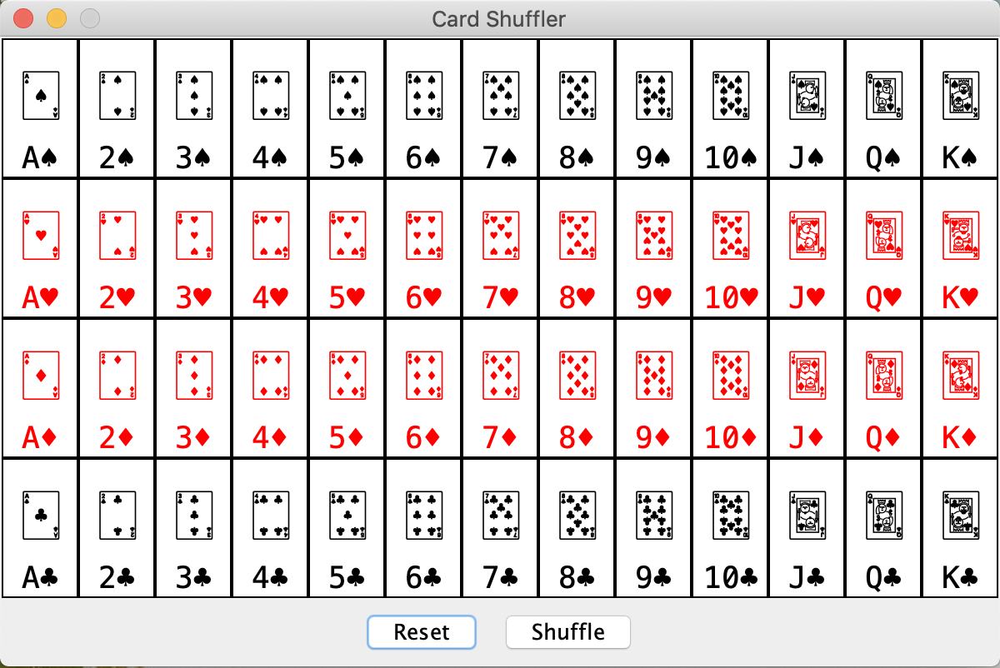
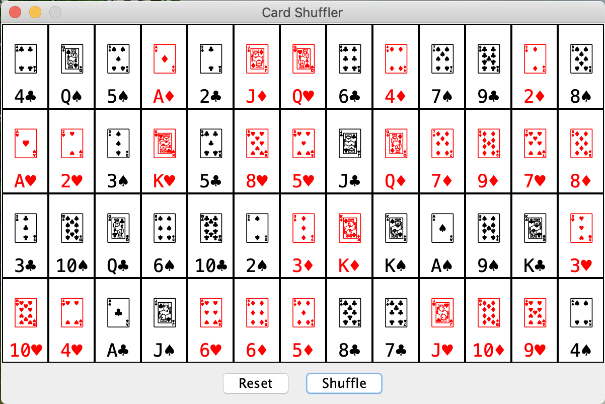

# Jason's Unicode Card Shuffler

## Requirement

- OpenJDK 19.0+ for development
- Maven 3+ for building
- JRE 8+ for running

## Installation

1. Copy the repository to a local drive `git clone git@github.com:jmsweb/card-shuffler.git`
2. Change into card-shuffler folder `cd card-shuffler`
  1. `mvn clean package` to build JAR
  2. `mvn clean compile -pl card-deck exec:java` to run JAR application
  3. `java -jar card-deck/target/card-deck.jar` on operating system

## Explanation
This code uses Javax Swing components for a GUI application.

There are three ways to execute the application;

- double-click on `card-deck-1.0.0-SNAPSHOT.jar`
- `java -jar card-deck/target/card-deck.jar` (Use this command on different computer)
- `mvn -pl card-deck exec:java` (Use this command to run application before building a jar)

The operating system should have the minimum version of Java Runtime Environment installed.

A few things about the application:
- The application cannot be resized.
- The exit button closes the application.
- The reset button would resets the card deck.
- The shuffle button would randomly shuffle the deck.

Refer to the two screenshots to illustrate the states:

## Build to Distribute (Without Signed Certificates)
Change into card-shuffler directory

Compile and Run - `mvn -pl card-deck clean compile exec:java`
Generate App Image - `jpackage --type app-image --main-jar card-deck-1.0.0-SNAPSHOT.jar --input card-deck/target --dest card-deck/build`
Generate MacOS Package (pkg) - `jpackage --type pkg --main-jar card-deck-1.0.0-SNAPSHOT.jar --input card-deck/target --dest card-deck/build`
Generate MacOS Installer (dmg) - `jpackage --type dmg --main-jar card-deck-1.0.0-SNAPSHOT.jar --input card-deck/target --dest card-deck/build`

Initial

Shuffled

